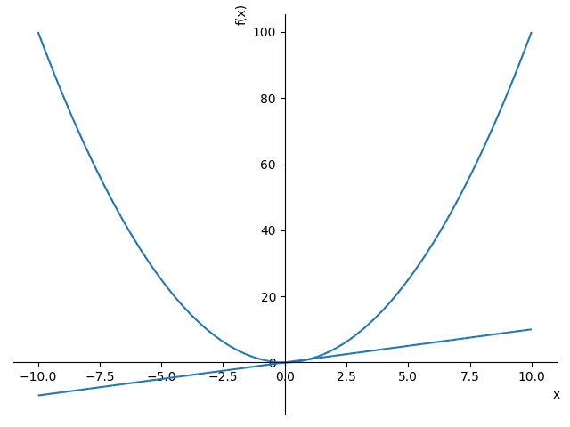
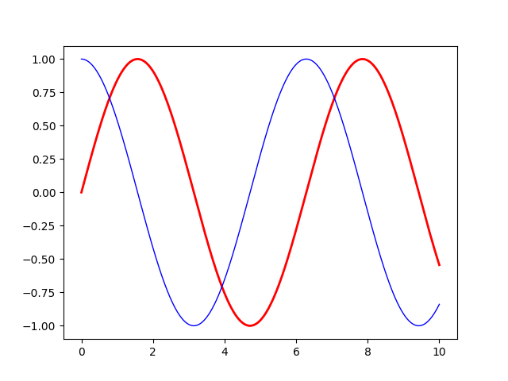
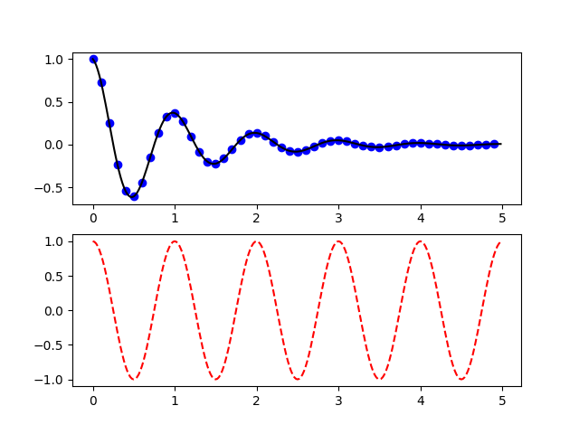
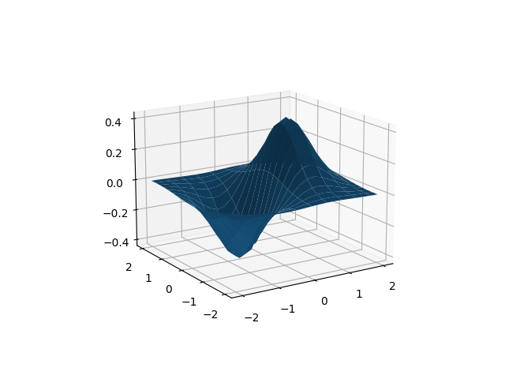
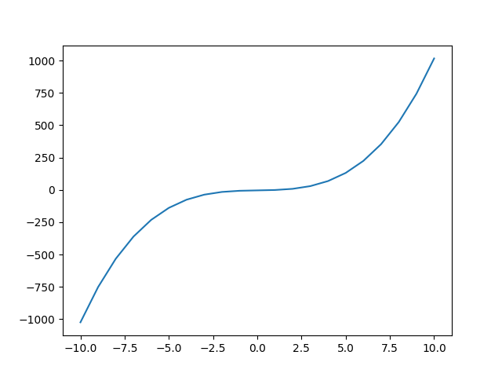
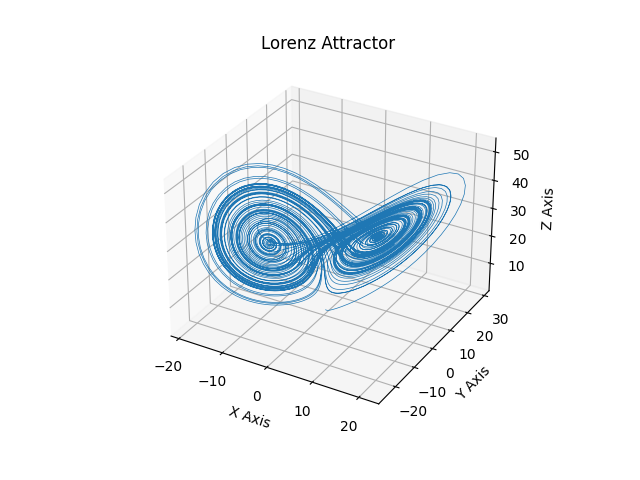
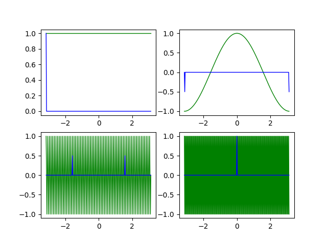

# W11上課筆記
# 科學計算
## [Numpy](https://numpy.org/)
NumPy 是 Python 語言的一個擴充程式庫。支援高階大量的維度陣列與矩陣運算，此外也針對陣列運算提供大量的數學函式函式庫。所有科學計算的基礎套件，放在 NumPy 的 N array 裡
* 安裝 numpy
```
pip install numpy
```

> 執行 numpy
```
PS C:\Users\User\Desktop\109-2school\ai\05-math\01-basic\numpy> python      # 進入python對話視窗
Python 3.7.7 (tags/v3.7.7:d7c567b08f, Mar 10 2020, 10:41:24) [MSC v.1900 64 bit (AMD64)] on win32
Type "help", "copyright", "credits" or "license" for more information.
>>> import numpy as np
>>> a = np.arange(0,4)
>>> b = np.arange(1,5)
>>> np.add(a,b)
array([1, 3, 5, 7])
>>> a+b
array([1, 3, 5, 7])
>>> a>b
array([False, False, False, False]) # a每項皆比b小 所以都False
>>> a*b
array([ 0,  2,  6, 12])             # [0*1,1*2,2*3,3*4]
>>> a
array([0, 1, 2, 3])
>>> b
array([1, 2, 3, 4])
>>> a.shape
(4,)                                #一維陣列,有四元素
>>> a.shape = (2,2)                 #分成
>>> a
array([[0, 1],
       [2, 3]])
>>> a.reshape((4,))
array([0, 1, 2, 3])
>>> a
array([[0, 1],
       [2, 3]])
>>> a.shape = (4,)
>>> a
array([0, 1, 2, 3])
>>> a.dtype
dtype('int32')
>>> e = np.linspace(0,1,10)         #從0~1分成10格
>>> e
array([0.        , 0.11111111, 0.22222222, 0.33333333, 0.44444444,
       0.55555556, 0.66666667, 0.77777778, 0.88888889, 1.        ])
>>> f = np.logspace(0,2,5)          #取log均分
>>> f
array([  1.        ,   3.16227766,  10.        ,  31.6227766 ,
       100.        ])
>>> g = np.zeros(4)                 #取4個0的陣列
>>> g
array([0., 0., 0., 0.])
>>> g.dtype                         #zeros預設型態為浮點數
dtype('float64')
>>> a
array([0, 1, 2, 3])
>>> a[2]
2
>>> a[2:4]                          #2-4不包含4
array([2, 3])
>>> a[1:4:2]                        #1-4每次跳兩格
array([1, 3])
>>> a[::-1]                         #把a陣列倒過來 a array([0, 1, 2, 3])
array([3, 2, 1, 0])
>>> x = np.random.randint(0,10,6)   #0-10取6個亂數
>>> x
array([6, 8, 4, 4, 3, 0])
>>> x[x>5]                          #大於5的數
array([6, 8])
>>> x[x>4] 
array([6, 8])
>>> x[x<5] 
array([4, 4, 3, 0])
>>> a
array([0, 1, 2, 3])
>>> b
array([1, 2, 3, 4])
>>> a@b                             #內積
20     
>>> a.dot(b)                        #內積
20                             
```

* sympy 符號套件 給公式,傳公式回來
> 安裝 sympy
```
pip install sympy
```
1. derive1.py (ai\05-math\01-basic\sympy)
```PS
PS C:\Users\User\Desktop\109-2school\ai\05-math\01-basic\sympy> python derive1.py
exp(x)*sin(x) + exp(x)*cos(x)
2*exp(x)*cos(x)
```
連鎖法則[WIKI](https://zh.wikipedia.org/zh-tw/%E9%93%BE%E5%BC%8F%E6%B3%95%E5%88%99)

2. dintegrate1.py (ai\05-math\01-basic\sympy)
> 積分
```python
i_expr=integrate(expr, (x, -oo, oo)) ##積到無限大
```
```PS
PS C:\Users\User\Desktop\109-2school\ai\05-math\01-basic\sympy> python dintegrate1.py
sqrt(2)*sqrt(pi)/2
```

3. factor1.py (ai\05-math\01-basic\sympy)  
>因式分解
```python
f_expr=factor(expr)     #因式分解
e_expr=expand(f_expr)   #算式展開
```
執行
```PS
PS C:\Users\User\Desktop\109-2school\ai\05-math\01-basic\sympy> python factor1.py
x*(x**3 + y + 8)
x**4 + x*y + 8*x
```

4. limit1.py (ai\05-math\01-basic\sympy)
>limit 趨近於0時
```python
x, y, z = symbols('x y z')
expr = sin(x)/x
l_expr=limit(expr, x, 0)
```
執行
```PS
PS C:\Users\User\Desktop\109-2school\ai\05-math\01-basic\sympy> python limit1.py 
1
```

5. plot1.py (ai\05-math\01-basic\sympy)
```python
x = symbols('x')
p1 = plot(x*x, show=False)
p2 = plot(x, show=False)
p1.append(p2[0])                
p1.show()
```
執行
```PS
python plot1.py 
```


6. simplify1.py (ai\05-math\01-basic\sympy)
>合併簡化
```python
from sympy import *
x,y = symbols('x y')
expr=(2*x)**3*(-5*x*y**2)
s_expr=simplify(expr)
print(s_expr)
```
執行
```PS
PS C:\Users\User\Desktop\109-2school\ai\05-math\01-basic\sympy> python simplify1.py
-40*x**4*y**2
```
7. solve1.py(ai\05-math\01-basic\sympy)
>求解
```python
from sympy import *
x = Symbol('x')
print(solve(6*x + 6*(x-2000)-150000,x))
```
執行
```PS
PS C:\Users\User\Desktop\109-2school\ai\05-math\01-basic\sympy> python solve1.py   
[13500]
```

8. solve2.py(ai\05-math\01-basic\sympy)
>求解
```python
from sympy import *
x,y = symbols('x y')
print(solve([x + y-10,2*x+y-16],[x,y]))
```
執行
```PS
PS C:\Users\User\Desktop\109-2school\ai\05-math\01-basic\sympy> python solve2.py
{x: 6, y: 4}
```
9. sqrt1.py(ai\05-math\01-basic\sympy)
>平方根
```python
import sympy,math
print(math.sqrt(8))
print(sympy.sqrt(8))
```
執行
```PS
PS C:\Users\User\Desktop\109-2school\ai\05-math\01-basic\sympy> python sqrt1.py 
2.8284271247461903
2*sqrt(2)           
```

## [matplotlib](https://matplotlib.org/)
matplotlib是Python語言及其數值計算庫NumPy的繪圖庫
* 安裝 matplotlib
```
pip install matplotlib 
```

* curve1.py (ai\05-math\01-basic\matplotlib)
```
python curve1.py
```
紅 sin0 藍cos0
結果


* curve2.py (ai\05-math\01-basic\matplotlib)
```python
plt.subplot(211)            #subplot(numRows,numCols,plotNum)畫成n*n的圖印幾張
```
執行 curve2.py
```
python curve2.py
```
結果


* curve3d.py (ai\05-math\01-basic\matplotlib)

執行 curve3d.py
```
python curve3d.py
```
結果


* graph1.py  (ai\05-math\01-basic\matplotlib)

執行 graph1.py 
```
python graph1.py 
```
結果


## 代數學
1. root2.py (ai\05-math\03-algebra\algebra\root2.py)
```PS
PS C:\Users\User\Desktop\109-2school\ai\05-math\03-algebra\algebra> python root2.py
root of 1x^2+4x+0= [0.0, -4.0]
```
2. 矩陣
* determinent1.py (ai\05-math\03-algebra\matrix)
>行列式
```python
import numpy as np
 
mat = [[1, 0, 2, -1],
       [3, 0, 0, 5],
       [2, 1, 4, -3],
       [1, 0, 5, 0]]
print('mat=', mat)
print('det=', np.linalg.det(mat))       #線性函式庫
```
結果
```PS
PS C:\Users\User\Desktop\109-2school\ai\05-math\03-algebra\matrix> python determinent1.py
mat= [[1, 0, 2, -1], [3, 0, 0, 5], [2, 1, 4, -3], [1, 0, 5, 0]]
det= 30.000000000000004
```

* detLU.py (ai\05-math\03-algebra\matrix)
>LU分解
```python
a = np.random.rand(3,3)                  #隨機產生3*3矩陣
p,l,u = sla.lu(a)
print('a=', np.dot(p, np.dot(l,u)))
print('p*l*u=', np.dot(p, np.dot(l,u)))
print('u =', u)
print('det(a)=', la.det(a))
print('det(u)=', la.det(u))
print('det(l)=', la.det(l))
print('det(p)=', la.det(p))
```
結果
```PS
PS C:\Users\User\Desktop\109-2school\ai\05-math\03-algebra\matrix> python detLU.py       
a= [[0.78513403 0.38722202 0.70984159]
 [0.28411145 0.38165176 0.61398999]   
 [0.24977369 0.90330511 0.45361574]]  
p*l*u= [[0.78513403 0.38722202 0.70984159]
 [0.28411145 0.38165176 0.61398999]
 [0.24977369 0.90330511 0.45361574]]
u = [[0.78513403 0.38722202 0.70984159]
 [0.         0.78011866 0.22779474]
 [0.         0.         0.28659729]]              #U是上三角矩陣
det(a)= -0.17554018374833738
det(u)= 0.17554018374833738
det(l)= 1.0
det(p)= -1.0
```

* detTheorem1.py (ai\05-math\03-algebra\matrix)
>|ab| = |a||b|
```python
a = np.random.rand(3,3)
b = np.random.rand(3,3)
ab = np.dot(a,b)
print('det(a)=', la.det(a))
print('det(b)=', la.det(b))
print('det(a)*det(b)=', la.det(a)*la.det(b))
print('det(ab)=', la.det(ab))
```
結果
```PS
PS C:\Users\User\Desktop\109-2school\ai\05-math\03-algebra\matrix> python detTheorem1.py
det(a)= -0.004123631261321069
det(b)= 0.2266037247769986
det(a)*det(b)= -0.0009344302034222272
det(ab)= -0.000934430203422228
```

* detTheorem2.py (ai\05-math\03-algebra\matrix)
>驗證高斯消去法
```python
a = np.random.rand(3,3)
print('a=', a)
print('det(a)=', la.det(a))

b = a.copy()
b[:, [0,1]] = b[:, [1,0]]
print('b=', b)
print('det(b)=', la.det(b)) # 兩行交換，det 變號

c = a.copy()
c[0] = c[0]*3
print('c=', c)
print('det(c)=', la.det(c)) # 一列乘以 k 倍的 det，等於 k 倍的 det 

d = a.copy()
d[1] += d[0]*3
print('d=', d)
print('det(d)=', la.det(d)) # 一列乘以 k 倍加到另一列，det 不變
```
結果
```PS
PS C:\Users\User\Desktop\109-2school\ai\05-math\03-algebra\matrix> python detTheorem2.py
a= [[0.51751332 0.90215589 0.31889596]
   [0.60245012 0.93756388 0.26436618]
   [0.90804027 0.96524969 0.92099022]]
det(a)= -0.055235261675636096
b= [[0.90215589 0.51751332 0.31889596]
   [0.93756388 0.60245012 0.26436618]
   [0.96524969 0.90804027 0.92099022]]
det(b)= 0.055235261675636166
c= [[1.55253996 2.70646766 0.95668788]
   [0.60245012 0.93756388 0.26436618]
   [0.90804027 0.96524969 0.92099022]]
det(c)= -0.16570578502690844
d= [[0.51751332 0.90215589 0.31889596]
   [2.15499008 3.64403154 1.22105406]
   [0.90804027 0.96524969 0.92099022]]
det(d)= -0.05523526167563612
```

* eigen1.py (ai\05-math\03-algebra\matrix)
>行列式的幾何意義 [特徵值和特徵向量WIKI](https://zh.wikipedia.org/wiki/%E7%89%B9%E5%BE%81%E5%80%BC%E5%92%8C%E7%89%B9%E5%BE%81%E5%90%91%E9%87%8F)
```python
A = np.array([[1,   -0.3], 
              [-0.1, 0.9]])
eA = linalg.eig(A)
print('eA=\n', eA)

l, X = eA
L = np.diag(l) # 把 lambda 轉成對角矩陣
print('L=\n', L)
print('X=\n', X)

XL = np.dot(X, L) # 為何用 X*L 說明在後面。 
AX = np.dot(A, X)

print('XL=\n', XL)
print('AX=\n', AX)
print('is XL==AX ?', np.allclose(XL,AX))

'''
  A1                    A1*X1 A1*X2 A1*X3
[ A2 ] [ X1 X2 X3 ] = [ A2*X1 A2*X2 A2*X3 ]
  A3                    A3*X1 A3*X2 A3*X3

A Xi = Li Xi
                             L1
A [X1 .. Xn] = [X1 ... Xn] [    L2          ]
                                  ...
'''
```
結果
```PS
PS C:\Users\User\Desktop\109-2school\ai\05-math\03-algebra\matrix> python eigen1.py     
eA=
 (array([1.13027756+0.j, 0.76972244+0.j]), array([[ 0.91724574,  0.79325185],
       [-0.3983218 ,  0.60889368]]))
L=
 [[1.13027756+0.j 0.        +0.j]
 [0.        +0.j 0.76972244+0.j]]
X=
 [[ 0.91724574  0.79325185]
 [-0.3983218   0.60889368]]
XL=
 [[ 1.03674228+0.j  0.61058374+0.j]
 [-0.45021419+0.j  0.46867912+0.j]]
AX=
 [[ 1.03674228  0.61058374]
 [-0.45021419  0.46867912]]
is XL==AX ? True
```
## 碎形積分[曼德布洛特複數集合WIKI](https://zh.wikipedia.org/wiki/%E6%9B%BC%E5%BE%B7%E5%8D%9A%E9%9B%86%E5%90%88)
微小差異會造成很大的差別~~蝴蝶效應
* mandelbrot.py (ai\05-math\04-calculus\chaos)


## 勞侖次吸引子[WIKI](https://zh.wikipedia.org/wiki/%E6%B4%9B%E4%BC%A6%E8%8C%A8%E5%90%B8%E5%BC%95%E5%AD%90#%E6%B4%9B%E4%BC%A6%E8%8C%A8%E6%96%B9%E7%A8%8B)
* lorenz.py  (ai\05-math\04-calculus\chaos)

## 傅立葉分析
* 將波型的震盪簡化
* 善於處理語音、影像的類別
>fft2pi.py (ai\05-math\04-calculus\fourier\01-fft2pi)

* 內容出處:傅立葉分析[WIKI](https://zh.wikipedia.org/wiki/%E5%82%85%E9%87%8C%E5%8F%B6%E5%88%86%E6%9E%90)
* [傅里叶分析之掐死教程](https://zhuanlan.zhihu.com/p/19763358?fbclid=IwAR2jVP63mr4--sW1ZFbK2mjyZ_c2qY8SolV39nB-3udBWpQlVV0SnvmbFtE)
