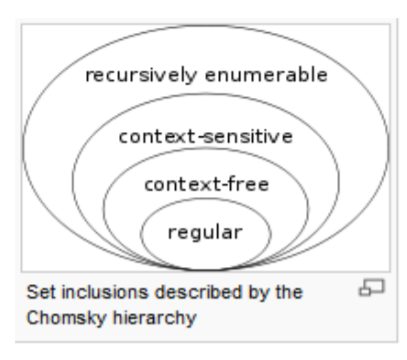

# W12上課筆記
# [自然語言處理](https://blog.csdn.net/Tiger_DAHE/article/details/111871450)

## 自然語言
1. 自然語言並非刻意「設計出來的」。例如中文、英文。是歷史逐漸演變的。
2. 人造語言由某個人從無到有所創造設計出來的，像是「C 語言、Python、JavaScript、Ruby、Perl 」這種語言通常有非常明確固定的語法，我們可以透過電腦程式去「解釋」這些語言的語法，然後做出對應的動作。
3. 標記語言，像是「HTML、XML、維基語言、Markdown、ReStructuredText」等，這類的語言乃是在自然語言上進行一些標記，以便讓程式可以透過標記進行對應的動作，像是加上粗體、加上超連結、顯示成表格、或者單純只是標記某個區塊的特性，像是 XML 的標記就是如此。

## 自然語言處理

## 深層語法
Chomsky Hierarchy (喬姆斯基語言階層）
1. Type1 :  語言的語法有點限制，因為每個規則的左邊至少要有一個非終端項目 A，但其前後可以連接任意規則，這種語法所能描述的語言稱為「對上下文敏感的語言」 (Context-Sensitive)，因為 可以決定之後到底是否要接 ，所以前後文之間是有關係的，因此才叫做「對上下文敏感的語言」。這種語言在計算理論上可以對應到「線性有界的非決定性圖靈機」，也就是一台「記憶體有限的電腦」。
2. Type 2 : 語言的語法限制更大，因為規則左邊只能有一個非終端項目 (以 A 代表)，規則右邊則沒有限制這種語言被稱為「上下文無關的語言」(Context Free) ，在計算理論上可以對應到 「非決定性的堆疊機」(non-deterministic pushdown automaton)。
3. Type 3 的語法限制是最多的，其規則的左右兩邊都最多只能有一個非終端項目 (以 A, B 表示) ，而且右端的終端項目 (以 a 表示) 只能放在非終端項目 B 的前面。這種語言稱為「正規式」(Regular)，可以用程式設計中常用的「正規表達式」(Regular Expression) 表示，對應到計算理論中的有限狀態機(Finite State Automaton)。


## 語言處理(簡單翻譯)
* e2c.py (ai\10-lang\rule\02-lookup)
```PS
python e2c.py a dog
['一隻', '狗']
```
## 生成語法
* gen1.py (ai\10-lang\rule\03-gen)
>給定機率 隨機產生結果及計算結果機率
```PS 
C:\Users\User\Desktop\109-2school\ai\10-lang\rule\03-gen> python gen1.py
['the', 'dog', 'chase', 'the', 'cat'] 0.031250
['a', 'dog', 'chase', 'the', 'cat'] 0.031250  
['the', 'dog', 'chase', 'the', 'dog'] 0.031250
['the', 'cat', 'chase', 'a', 'cat'] 0.031250  
['a', 'cat', 'chase', 'the', 'cat'] 0.031250  
['a', 'cat', 'chase', 'a', 'cat'] 0.031250    
['the', 'cat', 'chase', 'a', 'cat'] 0.031250  
['the', 'cat', 'chase', 'the', 'dog'] 0.031250
['a', 'dog', 'eat', 'a', 'cat'] 0.031250
['a', 'cat', 'chase', 'a', 'dog'] 0.031250
```

* english1.py (ai\10-lang\rule\03-gen)
>每次結果都不同,透過設定詞性與對應的詞去生成句子
```PS
PS C:\Users\User\Desktop\109-2school\ai\10-lang\rule\03-gen> python gen_english1.py
the dog chase a cat
PS C:\Users\User\Desktop\109-2school\ai\10-lang\rule\03-gen> python gen_english1.py
the dog eat the dog
PS C:\Users\User\Desktop\109-2school\ai\10-lang\rule\03-gen> python gen_english1.py
the dog chase a cat
```

* gen_chinese1.py (ai\10-lang\rule\03-gen)
```PS
PS C:\Users\User\Desktop\109-2school\ai\10-lang\rule\03-gen> python gen_chinese1.py
一隻 貓 吃 這隻 狗
PS C:\Users\User\Desktop\109-2school\ai\10-lang\rule\03-gen> python gen_chinese1.py
這隻 貓 追 這隻 貓
```

* gen_chinese2.py (ai\10-lang\rule\03-gen)
>增加了形容詞 "NP => Det Adj* N PP*"  
>"*" 代表都不產生
```PS
PS C:\Users\User\Desktop\109-2school\ai\10-lang\rule\03-gen> python gen_chinese2.py
一隻  貓 追 這隻 帥 白 貓
PS C:\Users\User\Desktop\109-2school\ai\10-lang\rule\03-gen> python gen_chinese2.py
這隻  貓 吃 一隻 白 帥 狗
```

* gen_exp1.py (ai\10-lang\rule\03-gen)
```PS
PS C:\Users\User\Desktop\109-2school\ai\10-lang\rule\03-gen> python gen_exp1.py
4*9-1-2*9*5/7-6-6-6*9*5+4+9+4+4-2/7+4/9+7/9+9-1-2/3/8-5*2/9-1-1 = -233.11507936507934
PS C:\Users\User\Desktop\109-2school\ai\10-lang\rule\03-gen> python gen_exp1.py
6 = 6
```

* gen_exp2_bug.py
>容易遞迴爆掉
```PS
PS C:\Users\User\Desktop\109-2school\ai\10-lang\rule\03-gen> python gen_exp2_bug.py
9-5/(3)*7*3*6+8 = -193.0
PS C:\Users\User\Desktop\109-2school\ai\10-lang\rule\03-gen> python gen_exp2_bug.py
2-6 = -4
```

* gen_math.py (ai\10-lang\rule\04-mathnlp)
>小學數學問題 -- 生成
```PS
PS C:\Users\User\Desktop\109-2school\ai\10-lang\rule\04-mathnlp> python gen_math.py
問題:   大雄有20個橘子
        又給了小華6個
        請問大雄還有幾個橘子?

答案:   3個
PS C:\Users\User\Desktop\109-2school\ai\10-lang\rule\04-mathnlp> python gen_math.py
問題:   小明有17個番茄
        又給了大雄1個
        請問小明還有幾個番茄?

答案:   2個
```

* parse_math.py (ai\10-lang\rule\04-mathnlp)
> 小學數學問題 -- Parse 
```PS
PS C:\Users\User\Desktop\109-2school\ai\10-lang\rule\04-mathnlp> python parse_math.py
['小明', '有', '5', '個', '蘋果', '，', '給', '了', '小華', '3', '個', '蘋果', '，', '請問', '他', '還', '剩', '幾', '個', '蘋果', '？']
tag=N word=小明
tag=V word=有
tag=D word=5
tag=d word=個
tag=N word=蘋果
tag=. word=，
tag=V word=給
tag=v word=了
tag=N word=小華
tag=D word=3
tag=d word=個
tag=N word=蘋果
tag=. word=，
tag=Q word=請問
tag=N word=他
tag=v word=還
tag=V word=剩
tag=D word=幾
tag=d word=個
tag=N word=蘋果
tag=. word=？
```
* parse_math.py (ai\10-lang\rule\04-mathnlp)
> 小學數學問題 -- 逐字翻譯
```PS
PS C:mt\Users\User\Desktop\109-2school\ai\10-lang\rule\04-mathnlp> python mt_math.py      
中文: ['小明', '有', '5', '個', '蘋果', '，', '給', '了', '小華', '3', '個', '蘋果', '，', '請問', '他', '還', '剩', '幾', '個', '蘋果', '？']
tag=N word=小明
tag=V word=有
tag=D word=5
tag=d word=個
tag=N word=蘋果
tag=. word=，
tag=V word=給
tag=v word=了
tag=N word=小華
tag=D word=3
tag=d word=個
tag=N word=蘋果
tag=. word=，
tag=Q word=請問
tag=N word=他
tag=v word=還
tag=V word=剩
tag=D word=幾
tag=d word=個
tag=N word=蘋果
tag=. word=？
英文： ['ShaoMin', 'have', '5', '_', 'apple', '，', 'give', '_', 'ShaoHua', '3', '_', 'apple', '，', 'Q', 'he', 'still', 'own', 'n?', '_', 'apple', '_.'] 
```