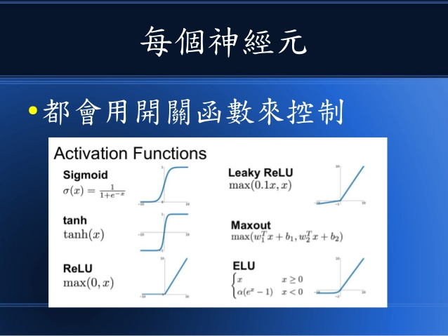
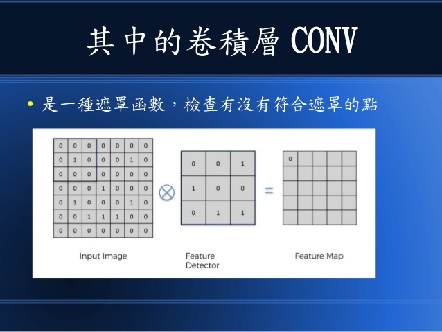
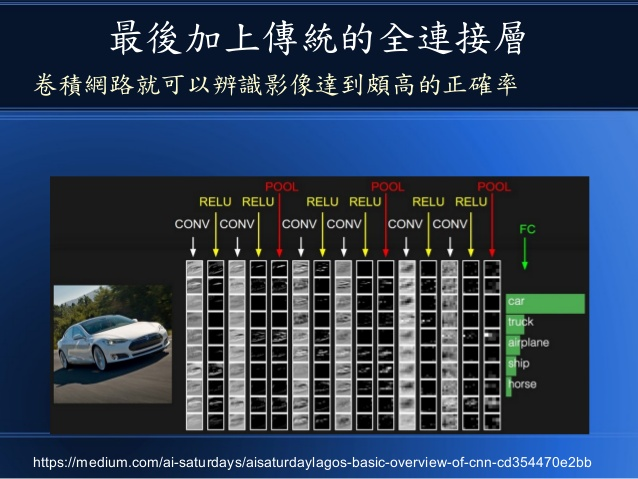
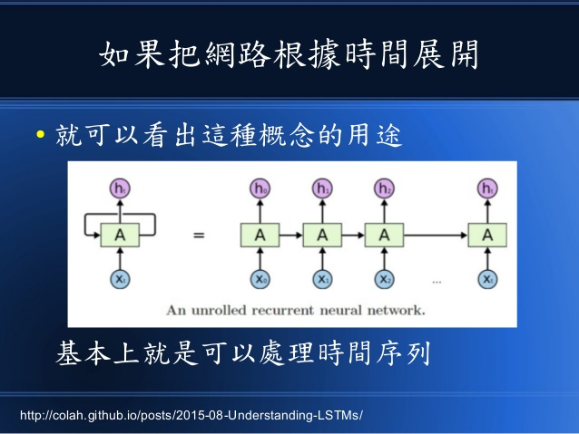
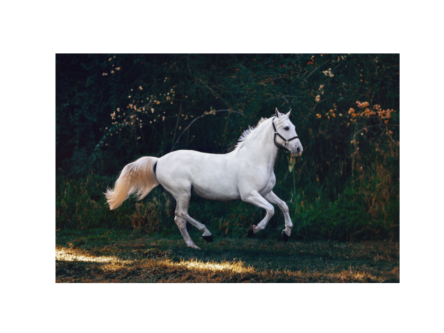
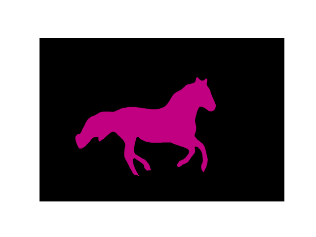

# W14上課筆記 
# 深度學習
[人工智慧與神經網路 投影片](https://www.slideshare.net/ccckmit/ss-94563680)  
[2018圖靈獎](https://buzzorange.com/techorange/2019/03/28/2019-turing-award/)  
[圖靈獎WIKI](https://zh.wikipedia.org/wiki/%E5%9B%BE%E7%81%B5%E5%A5%96)  
[DeepLearningBook](https://www.deeplearningbook.org/)  
## 人工智慧的方法
* 比對法 :紀錄問題與答案配對後，直接從表格內查出。ex:Ezisa
* 推理法 :撰寫規則後，電腦根據規則幫助推論。ex專家系統、
* 搜尋法 :深度優先或是廣度優先。ex下棋
* 統計法 :結合推理集搜尋,尋找機率最大的方法。ex:計算圓周率、中央極限定理
* 優化法 :爬山、模擬退火、梯度下降法、神經網路

## 神經網路-神經元的開關函數
ReLU有一段斜率為0不適用 梯度下降法 所以常常使用LeakyReLU


## 神經網路
* 梯度:朝斜率最大的方向
* 反傳遞演算法:套用微分的鏈鎖規則
* 統計和線性代數的最小平方法=優化(問題)法
* 神經網路使用 反傳遞演算法 會比單純使用 梯度演算法 更快!
* 新一代的神經網路層數多被稱為"深度學習"

## 深度學習得神經網路
### 1. 捲積神經網路 CNN
* 卷積層CONV是一種遮罩函數

* 遮罩可以區分深淺、認明邊緣，強調、弱化等效果
* 池化層Pool:降低維度(樣本數) 
* ReLU層: 提供門檻，使高於門檻的訊號通過(-1輸入則輸出=0,因為門檻>=0)

>[CNN範例](https://cs.stanford.edu/people/karpathy/convnetjs/)  
[mnist](https://cs.stanford.edu/people/karpathy/convnetjs/demo/mnist.html)  
[CIFAR-10](https://cs.stanford.edu/people/karpathy/convnetjs/demo/cifar10.html)  
### 2. 循環神經網路 RNN(LSTM,GRU)
* 簡單的RNN不穩定只能短期記憶
* 於是有人發明出[LSTM](https://zh.wikipedia.org/zh-tw/%E9%95%B7%E7%9F%AD%E6%9C%9F%E8%A8%98%E6%86%B6)
* 擅長風格複製(看起來很像...某種程式、論文、文章)
* 以前的googleTrans


### 3. 生成對抗網路 GAN
* 擅長模仿他人風格的照片圖像
* 素描、色塊 轉成 擬真相片
* 寶寶/老人濾鏡

### 4. 強化學習機制 Reinforcement Learning :AlphaGo
* 機器人(掃地...)
* AlphaGo(強化學習+神經網路+蒙地卡羅)策略網路+價值網路
## 深度學習
* 訓練集 避免[過擬合](https://wiki.mbalib.com/zh-tw/%E8%BF%87%E6%8B%9F%E5%90%88)
* 測試集 
* 驗證集 不再下降時應停止訓練

## Pytorch
(ai\08-deep\01-basic\main.py)取自[github](https://github.com/yunjey/pytorch-tutorial)

* alexnet.py  (ai\08-deep\02-pretrained\01-torchvision\01-classify)

安裝torch 很久...
``` PS 
pip install torch,torchvision
```
01.將辨識項目設為狗   
結果01(一開始下載model很花時間)
```PS 
C:\Users\User\Desktop\109-2school\ai\08-deep\02-pretrained\01-torchvision\01-classify> python alexnet.py      
Downloading: "https://download.pytorch.org/models/alexnet-owt-7be5be79.pth" to C:\Users\User/.cache\torch\hub\checkpoints\alexnet-owt-7be5be79.pth
100.0%
img_t.shape= torch.Size([3, 224, 224])          ##
batch_t.shape= torch.Size([1, 3, 224, 224])     ##
preds.shape= torch.Size([1, 1000])              ##從1000張中分析
208 Labrador retriever                          ##辨識為第208行拉不拉多
```

02. 將辨識項目設為鸚鵡 
```python
img = Image.open("img/parrot.jpg")
```
 結果02
```PS
C:\Users\User\Desktop\109-2school\ai\08-deep\02-pretrained\01-torchvision\01-classify> python alexnet.py      
img_t.shape= torch.Size([3, 224, 224])
batch_t.shape= torch.Size([1, 3, 224, 224])
preds.shape= torch.Size([1, 1000])      ##從1000張中分析
96 toucan                               ##把鸚鵡辨識第96行大嘴鳥
```
* predict.py (ai\08-deep\02-pretrained\01-torchvision\01-classify)  
0. 可以選擇模型
```python
if model == 'alexnet':
    net = models.alexnet(pretrained=True)
elif model == 'resnet18':
    net = models.resnet18(pretrained=True)
else:
    raise Exception('Error', 'model='+model)
```
1. 使用 alexnet 

``` PS
C:\Users\User\Desktop\109-2school\ai\08-deep\02-pretrained\01-torchvision\01-classify> python predict.py alexnet img/bee.jpg   
model= alexnet imgFile= img/bee.jpg
img_t.shape= torch.Size([3, 224, 224])
batch_t.shape= torch.Size([1, 3, 224, 224])
preds.shape= torch.Size([1, 1000])
class_idx= 70 label= harvestman, daddy longlegs, Phalangium opilio       ##把蜜蜂辨識第70行的狼蛛
```
2. 使用 resnet18 
```PS 
C:\Users\User\Desktop\109-2school\ai\08-deep\02-pretrained\01-torchvision\01-classify> python predict.py resnet18 img/bee.jpg 
model= resnet18 imgFile= img/bee.jpg
preds.shape= torch.Size([1, 1000])
class_idx= 309 label= bee                       ##把辨識第309行的蜜蜂了
```
>以bee圖比較得出>>  *resnet18* 較 *alexnet* 來的準確

* segment.py    (ai\08-deep\02-pretrained\01-torchvision\02-semantic)  
認別物體邊緣
1. fcn 好像很容易當掉 或是等很久
```
python segment.py fcn img/horse.jpg 
```
結果圖

2. dlab
```
python segment.py dlab img/horse.jpg 
```
結果圖
