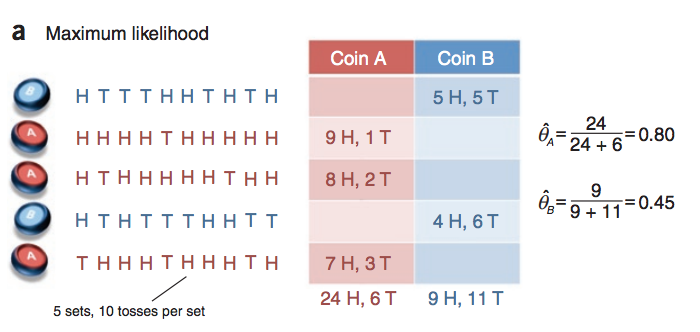
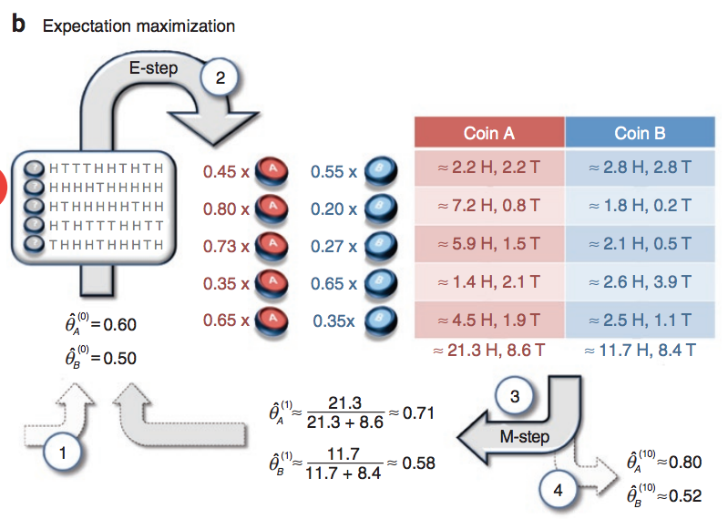

# W16上課筆記 
# 機器學習

## 蒙地卡羅法(ai\06-learn\01-montecarlo)
使用大量樣本來獲得最靠近的期望值  
>圖來自[維基蒙地卡羅方法](https://zh.wikipedia.org/wiki/%E8%92%99%E5%9C%B0%E5%8D%A1%E7%BE%85%E6%96%B9%E6%B3%95#/media/File:Pi_30K.gif)


* monteCarloPi.py
```python
from random import random

def monteCarloPi(n):
    hits = 0
    for _ in range(n):
        x = random()
        y = random()        #取0~1的亂數
        if (x*x+y*y <= 1):  #判斷在圓內
            hits += 1
    return 4*(hits/n)       #n就是所有點

print('MonteCarloPi(100000)=', monteCarloPi(100000))


```
執行結果 (因隨機取樣,所以結果不會很準在3.14159)
```
PS C:\Users\User\Desktop\109-2school\ai\06-learn\01-montecarlo> python monteCarloPi.py
MonteCarloPi(100000)= 3.14384
PS C:\Users\User\Desktop\109-2school\ai\06-learn\01-montecarlo> python monteCarloPi.py
MonteCarloPi(100000)= 3.14072
PS C:\Users\User\Desktop\109-2school\ai\06-learn\01-montecarlo> python monteCarloPi.py
MonteCarloPi(100000)= 3.14276
PS C:\Users\User\Desktop\109-2school\ai\06-learn\01-montecarlo> python monteCarloPi.py
MonteCarloPi(100000)= 3.14988
PS C:\Users\User\Desktop\109-2school\ai\06-learn\01-montecarlo> 

```
## 馬可夫鏈(ai\06-learn\02-markov\matrix)
一種具有狀態的隨機過程,狀態間互相轉移且機率是固定,不隨時間改變。

圖片來自[馬可夫鏈範例](http://programmermedia.org/root/%E9%99%B3%E9%8D%BE%E8%AA%A0/%E8%AA%B2%E7%A8%8B/%E4%BA%BA%E5%B7%A5%E6%99%BA%E6%85%A7/_doc/%E6%A9%9F%E5%99%A8%E5%AD%B8%E7%BF%92/B2-%E9%A6%AC%E5%8F%AF%E5%A4%AB%E9%8F%88.md)


|||
|---|---|
prob.py                       |列出狀態與轉移機率  
markov.py                     |列出馬可夫算法  
gibbs.py                      |Gibbs Algorithm給定機率確認何時收斂 

>關於Gibbs Algorithm: [WIKI吉布斯採樣](https://zh.wikipedia.org/wiki/%E5%90%89%E5%B8%83%E6%96%AF%E9%87%87%E6%A0%B7)

* markov.py
```
PS C:\Users\User\Desktop\109-2school\ai\06-learn\02-markov\matrix> python markov.py
P(b a b b) = P(b) P(b=>a) P(a=>b) P(b=>b) = 0.8*0.5*0.3*0.5 = 0.06
```
* gibbs.py 
```
PS C:\Users\User\Desktop\109-2school\ai\06-learn\02-markov\matrix> python gibbs.py 
P0 = [0.2 0.8]
P1={} [0.54 0.46]      
P1={} [0.608 0.392]    
P1={} [0.6216 0.3784]  
P1={} [0.62432 0.37568]
P1={} [0.624864 0.375136]
標準答案:P(a)=5/8=0.625 P(b)=3/8=0.375
```
>關於隱馬可夫鏈[WIKI隱藏式馬可夫鏈模型](https://zh.wikipedia.org/zh-tw/%E9%9A%90%E9%A9%AC%E5%B0%94%E5%8F%AF%E5%A4%AB%E6%A8%A1%E5%9E%8B)  
關於維特比演算法[WIKI維特比演算法](https://zh.wikipedia.org/wiki/%E7%BB%B4%E7%89%B9%E6%AF%94%E7%AE%97%E6%B3%95)

## 維特比演算法(ai\06-learn\04-hmm)

* viterbi.py
```
PS C:\Users\User\Desktop\109-2school\ai\06-learn\04-hmm> python viterbi.py
觀察到的序列= ['喵', '喵', '汪']
T= [{}, {}, {}, {}]
t=1 path={'N': ['V', 'N'], 'V': ['N', 'V']}
t=2 path={'N': ['N', 'V', 'N'], 'V': ['V', 'N', 'V']}
T= [{'N': 0.24, 'V': 0.2}, {'N': 0.06400000000000002, 'V': 0.08399999999999999}, {'N': 0.040319999999999995, 'V': 0.022400000000000003}, {}]
prob=0.040319999999999995 path=['N', 'V', 'N']＝最可能的隱序列
```

## 最大期望演算法(ai\06-learn\05-em)
[WIKI最大期望演算法](https://zh.wikipedia.org/wiki/%E6%9C%80%E5%A4%A7%E6%9C%9F%E6%9C%9B%E7%AE%97%E6%B3%95)
* 統計中被用於尋找，依賴於不可觀察的隱性變量的概率模型中，參數的最大似然估計。  




* em.py
```
PS C:\Users\User\Desktop\109-2school\ai\06-learn\05-em> python em.py
pA=[0.6, 0.4] pB=[0.5, 0.5] delta=9.9999
pA=[0.71301224 0.28698776] pB=[0.58133931 0.41866069] delta=0.11301223540051619 
pA=[0.74529204 0.25470796] pB=[0.56925575 0.43074425] delta=0.0322798006814784  
pA=[0.76809883 0.23190117] pB=[0.54953591 0.45046409] delta=0.022806798285326613
pA=[0.78316458 0.21683542] pB=[0.53461745 0.46538255] delta=0.015065749932652417
pA=[0.79105525 0.20894475] pB=[0.52628117 0.47371883] delta=0.008336287117588381
pA=[0.79453254 0.20546746] pB=[0.52239044 0.47760956] delta=0.003890729512057156
pA=[0.79592867 0.20407133] pB=[0.52072988 0.47927012] delta=0.001660559431849007
```

## K-近鄰演算法(KNN)(ai\06-learn\07-classify)
[[Day26]機器學習：KNN分類演算法！](https://ithelp.ithome.com.tw/articles/10197110)
* knn.py  
    - 使用鳶尾花資料庫  

安裝 sklearn套件
```
pip install sklearn
```
程式碼
```python
from sklearn import datasets
from sklearn.model_selection import train_test_split
from sklearn.neighbors import KNeighborsClassifier
import numpy as np

iris = datasets.load_iris()         #鳶尾花資料庫  

iris_data = iris.data
iris_label = iris.target

train_data , test_data , train_label , test_label = train_test_split(iris_data,iris_label,test_size=0.2)

knn = KNeighborsClassifier() # n_neighbors=5
# knn = KNeighborsClassifier(n_neighbors=1)
# knn = KNeighborsClassifier(n_neighbors=3)
# knn = KNeighborsClassifier(n_neighbors=37)

knn.fit(train_data,train_label) #做分類

print('預測答案：', knn.predict(test_data)) #預設答案
print('正確答案：', test_label)             #測試集正確答案
```
結果
```
預測答案： [2 0 2 1 1 2 2 0 2 0 2 0 2 1 0 1 2 0 1 0 0 0 2 2 1 0 0 0 0 0]
正確答案： [2 0 2 1 1 2 2 0 2 0 2 0 2 1 0 1 2 0 1 0 0 0 2 2 1 0 0 0 0 0]

```
