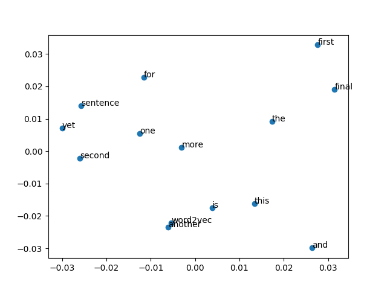

# W17上課筆記

# google翻譯套件
googlelemt1.py
引入 googletrans 套件
```
pip install googletrans
~
python googlemt1.py
```
# 詞向量
[讓電腦看得懂人類語言的第一步 - 詞向量](https://zh-tw.coderbridge.com/series/2ec9cf0af3f74ed99371952f4849ae33/posts/0c71ef945cf14e2da414e4a31b1f4381)

## pretrained.py 說明
```python
import gensim.downloader
# Show all available models in gensim-data
# print(list(gensim.downloader.info()['models'].keys()))
model = gensim.downloader.load('glove-twitter-25') #下載詞向量模型

print(f"model.most_similar('twitter')={model.most_similar('twitter')}")
print(f"model.most_similar('dog')={model.most_similar('dog')}")
print(f"model.most_similar('mother')={model.most_similar('mother')}")
print(f"model.most_similar('king')={model.most_similar('king')}")
print(f"model.most_similar('push')={model.most_similar('push')}")
print(f"model.most_similar(positive=['woman', 'king'], negative=['man'])={model.most_similar(positive=['woman', 'king'], negative=['man'])}")
```
1. 引入 gensim 套件(已經訓練好的詞向量)
```
pip install gensim
~
python pretrained.py
```

2. 結果
```
model.most_similar('twitter')=[('facebook', 0.948005199432373), ('tweet', 0.9403423070907593), ('fb', 0.9342358708381653), ('instagram', 0.9104824066162109), ('chat', 0.8964964747428894), ('hashtag', 0.8885937333106995), ('tweets', 0.8878158330917358), ('tl', 0.8778461217880249), ('link', 0.8778210878372192), ('internet', 0.8753897547721863)]
model.most_similar('dog')=[('cat', 0.9590821266174316), ('dogs', 0.9244232177734375), ('horse', 0.9209403395652771), ('monkey', 0.9146843552589417), ('pig', 0.9116264581680298), ('kid', 0.902455747127533), ('puppy', 0.9024084210395813), ('bear', 0.9013873934745789), ('pet', 0.8971228003501892), ('dirty', 0.8893660306930542)]
model.most_similar('mother')=[('father', 0.9509677886962891), ('child', 0.937720537185669), ('daughter', 0.9361845254898071), ('friend', 0.9293223023414612), ('sister', 0.9281293153762817), ('wife', 0.9274637699127197), ('woman', 0.9214696884155273), ('girl', 0.9200195074081421), ('mom', 0.9165931344032288), ('dad', 0.9141177535057068)]
model.most_similar('king')=[('prince', 0.9337409734725952), ('queen', 0.9202421307563782), ('aka', 0.9176921844482422), ('lady', 0.9163240790367126), ('jack', 0.9147354364395142), ("'s", 0.9066898226737976), ('stone', 0.8982374668121338), ('mr.', 0.8919409513473511), ('the', 0.889343798160553), ('star', 0.8892088532447815)]
model.most_similar('push')=[('carry', 0.9432511329650879), ('hold', 0.9204720258712769), ('step', 0.9168412685394287), ('handle', 0.9149768352508545), ('reach', 0.9070982336997986), ('take', 0.9024859666824341), ('able', 0.8978244066238403), ('moves', 0.8954479098320007), ('aim', 0.8929283618927002), ('pass', 0.8912724852561951)]
model.most_similar(positive=['woman', 'king'], negative=['man'])=[('meets', 0.8841924071311951), ('prince', 0.832163393497467), ('queen', 0.8257461190223694), ('’s', 0.8174097537994385), ('crow', 0.813499391078949), ('hunter', 0.8131037950515747), ('father', 0.8115834593772888), ('soldier', 0.81113600730896), ('mercy', 0.8082392811775208), ('hero', 0.8082264065742493)]
```


## viewTrained.py 說明
```
pip install matplotlib,sklearn  
```
viewTrained詞向量分布



## trainCorpus.py 
[來源:gensim](https://machinelearningmastery.com/develop-word-embeddings-python-gensim/)  

結果 
```terminal
PS C:\Users\User\Desktop\109-2school\ai\10-lang\nn\01-word2vec\01-gensim> python trainCorpus.py
model= Word2Vec(vocab=14, vector_size=100, alpha=0.025)
words= ['sentence', 'the', 'is', 'this', 'final', 'and', 'more', 'one', 'another', 'yet', 'second', 'word2vec', 'for', 'first']
vw(sentence)= [-5.3622725e-04  2.3643016e-04  5.1033497e-03  9.0092728e-03
 -9.3029495e-03 -7.1168090e-03  6.4588715e-03  8.9729885e-03
 -5.0154282e-03 -3.7633730e-03  7.3805046e-03 -1.5334726e-03
 -4.5366143e-03  6.5540504e-03 -4.8601604e-03 -1.8160177e-03
  2.8765798e-03  9.9187379e-04 -8.2852151e-03 -9.4488189e-03
  7.3117660e-03  5.0702621e-03  6.7576934e-03  7.6286553e-04
  6.3508893e-03 -3.4053659e-03 -9.4640255e-04  5.7685734e-03
 -7.5216386e-03 -3.9361049e-03 -7.5115822e-03 -9.3004224e-04
  9.5381187e-03 -7.3191668e-03 -2.3337698e-03 -1.9377422e-03
  8.0774352e-03 -5.9308959e-03  4.5161247e-05 -4.7537349e-03
 -9.6035507e-03  5.0072931e-03 -8.7595871e-03 -4.3918253e-03
 -3.5099984e-05 -2.9618264e-04 -7.6612402e-03  9.6147414e-03
  4.9820566e-03  9.2331432e-03 -8.1579182e-03  4.4957972e-03
 -4.1370774e-03  8.2453492e-04  8.4986184e-03 -4.4621779e-03
  4.5175003e-03 -6.7869616e-03 -3.5484887e-03  9.3985079e-03
 -1.5776539e-03  3.2137157e-04 -4.1406299e-03 -7.6826881e-03
 -1.5080094e-03  2.4697948e-03 -8.8802812e-04  5.5336617e-03
 -2.7429771e-03  2.2600652e-03  5.4557943e-03  8.3459523e-03
 -1.4537406e-03 -9.2081428e-03  4.3705511e-03  5.7178497e-04
  7.4419067e-03 -8.1328390e-04 -2.6384138e-03 -8.7530091e-03
 -8.5655687e-04  2.8265619e-03  5.4014279e-03  7.0526553e-03
 -5.7031228e-03  1.8588186e-03  6.0888622e-03 -4.7980524e-03
 -3.1072616e-03  6.7976285e-03  1.6314745e-03  1.8991709e-04
  3.4736372e-03  2.1777629e-04  9.6188262e-03  5.0606038e-03
 -8.9173913e-03 -7.0415614e-03  9.0145587e-04  6.3925339e-03]
new_model= Word2Vec(vocab=14, vector_size=100, alpha=0.025)
```

## dogcat.py 說明
* dogcat2vec.py  
```python
model.train(data, total_examples=model.corpus_count, epochs=100) # 跑100
```
經過訓練後 結果
```
a
    similars:[('dog', 0.9971901178359985), ('cat', 0.99690181016922), ('eat', 0.9939289689064026)]
dog
    similars:[('cat', 0.9979520440101624), ('a', 0.9971902370452881), ('chase', 0.9946250319480896)]
cat
    similars:[('dog', 0.9979518055915833), ('a', 0.9969016909599304), ('eat', 0.993695855140686)]
chase
    similars:[('dog', 0.9946248531341553), ('cat', 0.9935394525527954), ('eat', 0.9931081533432007)]
eat
    similars:[('a', 0.9939289689064026), ('dog', 0.993914783000946), ('cat', 0.9936960339546204)]
the
    similars:[('eat', 0.9575374126434326), ('a', 0.9541037678718567), ('chase', 0.95405513048172)]
```
## seq2seq: [seq2seq](https://pytorch.org/tutorials/intermediate/seq2seq_translation_tutorial.html)

# 人工智能五子棋
## human_play.py
* 輸了...
```
Player 1 with X
Player 2 with O

       0       1       2       3       4       5       6       7

   7   _       X       O       X       X       X       X       O


   6   O       X       X       X       X       O       O       X


   5   _       O       O       X       X       O       O       _


   4   X       X       X       O       O       X       O       _


   3   _       O       O       X       O       X       O       _


   2   X       O       O       O       O       X       O       _


   1   O       X       O       X       O       O       X       _


   0   _       _       O       O       X       X       X       _


Game end. Winner is MCTS 2
```