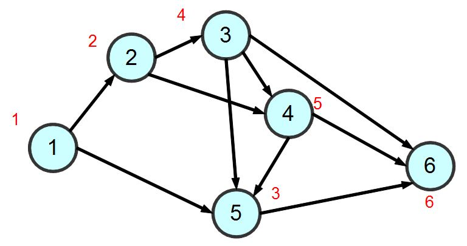

# W4上課筆記
## 線性規劃[WIKI](https://zh.wikipedia.org/wiki/%E7%BA%BF%E6%80%A7%E8%A7%84%E5%88%92)
線性規劃（Linear Programming，簡稱LP）特指目標函數和約束條件皆為線性的最佳化問題。

## NP完全
NP完全或NP完備（NP-Complete，縮寫為NP-C或NPC）,是計算複雜度理論中，決定性問題的等級之一。

## bigO Sorting
    * 泡沫排序法 : 時間複雜度 = n的2次方
    * 循序搜尋法 : 時間複雜度 = n

## 圖形搜尋
### 1. 深度優先搜尋 (Depth-First Search, DFS)
優先往路徑最短且沒拜訪過的節點移動  
順序為: 123456

### 2. 廣度優先搜尋 (Breath-First Search, BFS)
由淺入深的最短路徑拜訪  
順序為: 125346


### DFS vs BFS
* graph_search.py (ai\03-search\02-search)  
結果
```
PS C:\Users\User\Desktop\109-2school\ai\03-search\02-search> python graph_search.py
dfs:1 => 2 => 3 => 4 => 5 => 6 => 
bfs:1 => 2 => 5 => 3 => 4 => 6 => 
```
### 3. 最佳優先搜尋 (Best-First Search, BestFS) 