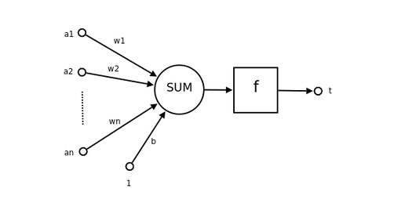
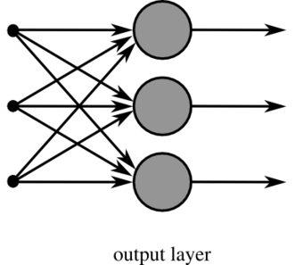

# W9上課筆記
## 神經網路介紹
在電腦領域，神經網路是指一種模擬神經系統所設計出來的程式，用來模擬人類視覺、聽覺等等智慧行為的原理，企圖讓電腦可以具有人類智慧的一種方法。
>單一神經元模型
>* a1 ... an 是輸入
>* w1 ... wn 是權重
>* 輸入乘上權重之後加總(SUM)，就會得到神經元的刺激強度
>* 經過函數 f() 轉換之後，就得到了輸出的刺激強度。

## 單層神經元網路
>是最基本的神經元網路形式，由有限個神經元構成，所有神經元的輸入向量都是同一個向量。由於每一個神經元都會產生一個純量結果，所以單層神經元的輸出是一個向量，向量的維數等於神經元的數目。
> 

## 單變數微分
> diff.py (ai\07-neural\02-gradient\01-diff)
```PS  C:\Users\User\Desktop\109-2school\ai\07-neural\02-gradient\01-diff> python diff.py
diff(f,2)= 12.006000999997823
```
## e (自然常數、自然底數)
* e的微分是自己，積分也是自己
* 執行結果會趨近於e
>e.py (ai\07-neural\02-gradient\01-diff)
```PS 
PS C:\Users\User\Desktop\109-2school\ai\07-neural\02-gradient\01-diff> python e.py         
n= 100.0 e(n)= 2.7048138294215285
n= 200.0 e(n)= 2.711517122929317 
~
n= 9900.0 e(n)= 2.718144554210053
n= 10000.0 e(n)= 2.7181459268249255
```

## 梯度下降
* 梯度就是斜率最大的那個方向
* 我們朝著《斜率最大》方向的《正梯度》走，就會愈走愈高，朝著《逆梯度》方向走，就會愈走愈低。
* 梯度下降法，就是朝著《逆梯度》的方向走，於是就可以不斷下降，直到到達梯度為 0 的點 (斜率最大的方向仍然是斜率為零)，此時就已經到了一個《谷底》，也就是區域的最低點了
>grad1.py(ai\05-math\04-calculus\vfield)
```PS 
C:\Users\User\Desktop\109-2school\ai\05-math\04-calculus\vfield> python grad1.py 
x,y= 1.001 3.0
x,y= 1.0 3.0
df(f, p, 0) =  2.0009999999999195
x,y= 1.0 3.001
x,y= 1.0 3.0
df(f, p, 1) =  6.000999999999479 
x,y= 1.001 3.0
x,y= 1.0 3.0
x,y= 1.0 3.001
x,y= 1.0 3.0
grad(f)= [2.001 6.001]
```