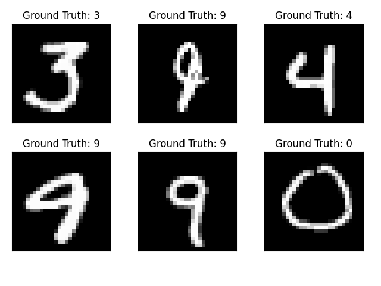
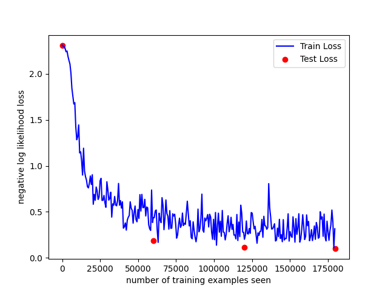
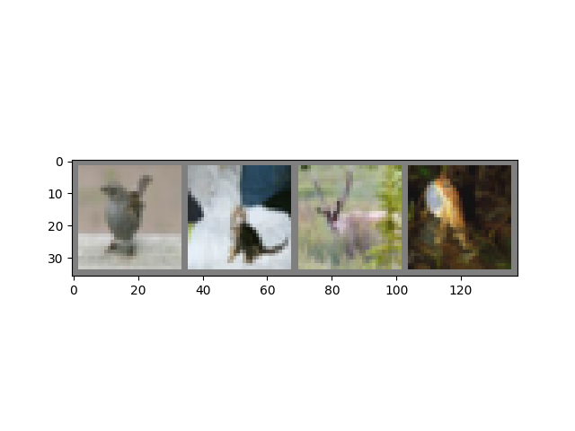
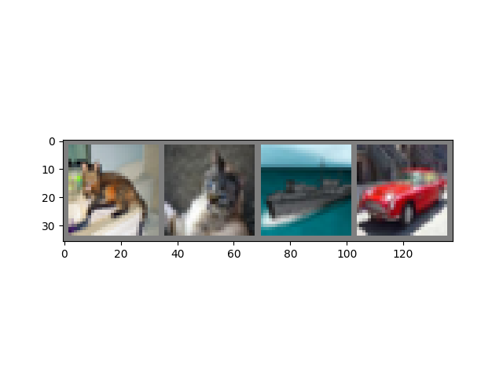
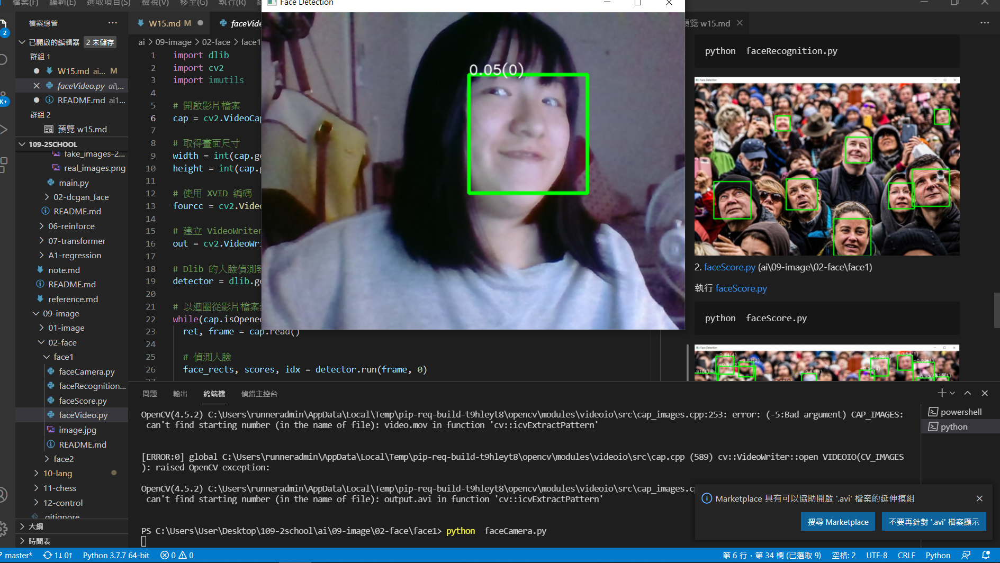

# W15上課筆記 
# 深度學習- cnn
## MNIST 手寫辨識
[mnist](https://cs.stanford.edu/people/karpathy/convnetjs/demo/mnist.html)   
[MNIST Handwritten Digit Recognition in PyTorch](https://nextjournal.com/gkoehler/pytorch-mnist)
* mnist2.py (ai\08-deep\03-cnn\01-mnist)
```
python mnist2.py
Test set: Avg. loss: 2.3096, Accuracy: 924/10000 (9%)
Test set: Avg. loss: 0.1844, Accuracy: 9449/10000 (94%)
Test set: Avg. loss: 0.1165, Accuracy: 9637/10000 (96%)
Test set: Avg. loss: 0.0983, Accuracy: 9684/10000 (97%)
```



## cifar 物體辨識
* cifar.py(ai\08-deep\03-cnn\02-cifar)
1. Predict
```
python cifar.py predict
Predicted:   bird horse  deer   dog
```
應是 bird / monkey / deer / frog

2. test
```
python cifar.py test   
Accuracy of the network on the 10000 test images: 58 %
```
3. answer
```
python cifar.py answer
cat   cat  ship   car
```


# 深度學習- RNN
[The Unreasonable Effectiveness of Recurrent Neural Networks](http://karpathy.github.io/2015/05/21/rnn-effectiveness/)

* RNN善於去學習風格
>點亮綠色節點會發現會有另外的綠色節點亮起,而且觀察得出綠色節點皆為網址


1. main.py (ai\08-deep\04-rnn\01-language_model)
main.py
```python
# main.py
# Load "Penn Treebank" dataset
corpus = Corpus()
ids = corpus.get_data('train.txt', batch_size)  ##獲取訓練文章(老師以train.txt為例)
vocab_size = len(corpus.dictionary)             ##抓進詞彙,將字母對應one-hot
num_batches = ids.size(1) // seq_length
```
執行 main.py
```PS 
C:\Users\User\Desktop\109-2school\ai\08-deep\04-rnn\01-language_model> python main.py
Epoch [1/5], Step[0/1], Loss: 2.2006, Perplexity:  9.03
Epoch [2/5], Step[0/1], Loss: 2.1481, Perplexity:  8.57
Epoch [3/5], Step[0/1], Loss: 2.0994, Perplexity:  8.16
Epoch [4/5], Step[0/1], Loss: 2.0672, Perplexity:  7.90
Epoch [5/5], Step[0/1], Loss: 2.0266, Perplexity:  7.59
Sampled [100/1000] words and save to sample.txt
Sampled [200/1000] words and save to sample.txt
Sampled [300/1000] words and save to sample.txt
Sampled [400/1000] words and save to sample.txt
Sampled [500/1000] words and save to sample.txt
Sampled [600/1000] words and save to sample.txt
Sampled [700/1000] words and save to sample.txt
Sampled [800/1000] words and save to sample.txt
Sampled [900/1000] words and save to sample.txt
Sampled [1000/1000] words and save to sample.txt
```
得出的sample.txt(節錄前兩段)
```
a+b (a+b)+a (a+(b+a))+b a (a+b)+(b+a) 


a+b (a+b)+a a+(b+a) a+(b+a) a+(b+a) b b b b (a+(b+a))+b b b b (a+b)+(b+a) b 
a+b ((a+b)+a)+((b+a)+b) b (a+b)+(b+a) (a+(b+a))+b (a+(b+a))+b (a+(b+a))+b ((a+b)+a)+((b+a)+b) (a+b)+a 
a+b a+b (a+b)+a ((a+b)+a)+((b+a)+b) a a b a+b b (a+b)+(b+a) a (a+b)+a (a+(b+a))+b b a+b a+(b+a) a a+(b+a) b a b a b b (a+b)+a b (a+b)+(b+a) a b a a+b b (a+b)+a b (a+b)+(b+a) 
```
## 圖像人臉辨識 (ai\09-image)  
需先安裝套件
```
pip install opencv-python imutils dlib
## dlib要先安裝  cmake,boost
pip install cmake
pip install boost
```
1. faceRecognition.py (ai\09-image\02-face\face1)

執行 faceRecognition.py
```
python  faceRecognition.py
```

2. faceScore.py (ai\09-image\02-face\face1)

執行 faceScore.py
```
python  faceScore.py
```


3.faceCamera.py
執行 faceCamera.py
```
python  faceCamera.py
```


[深度學習相關文章](https://murphymind.blogspot.com/2018/02/deep.learning.core.concepts.html)  
[deeplearningbook](https://www.deeplearningbook.org/)