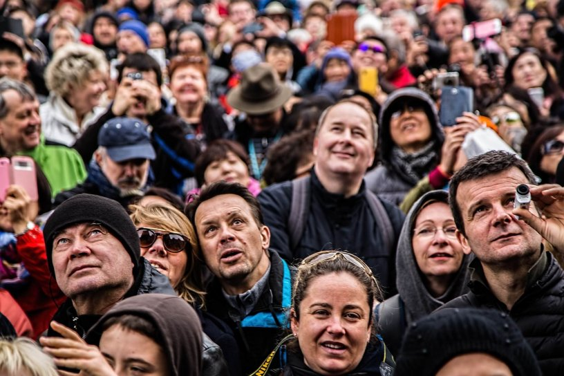
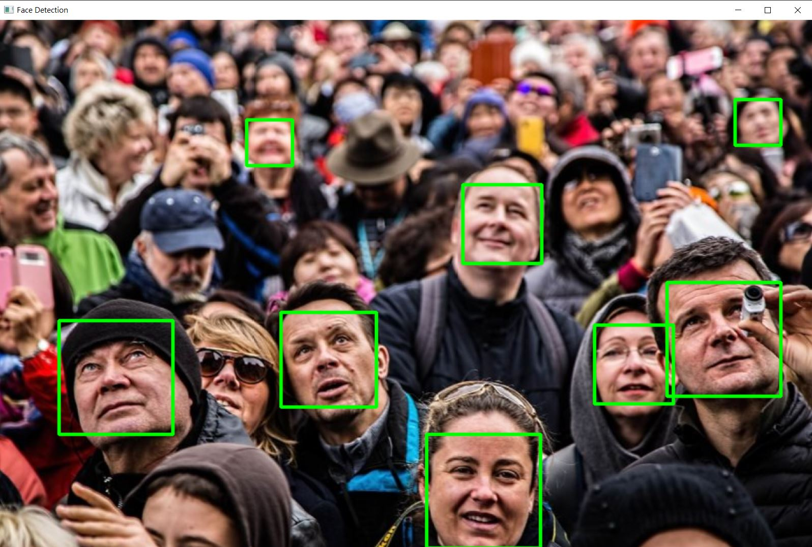
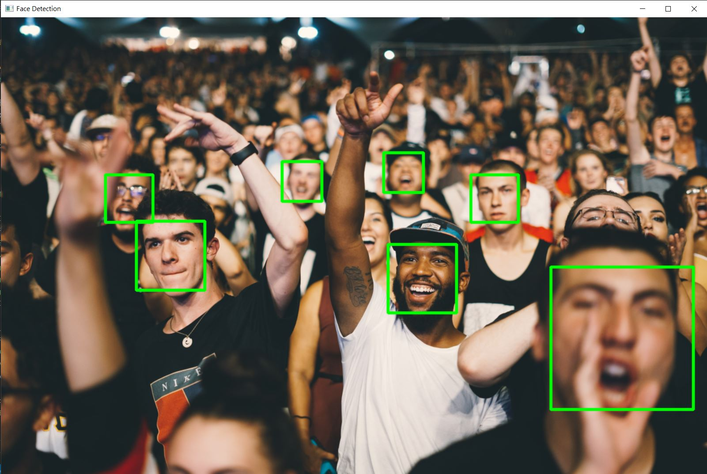
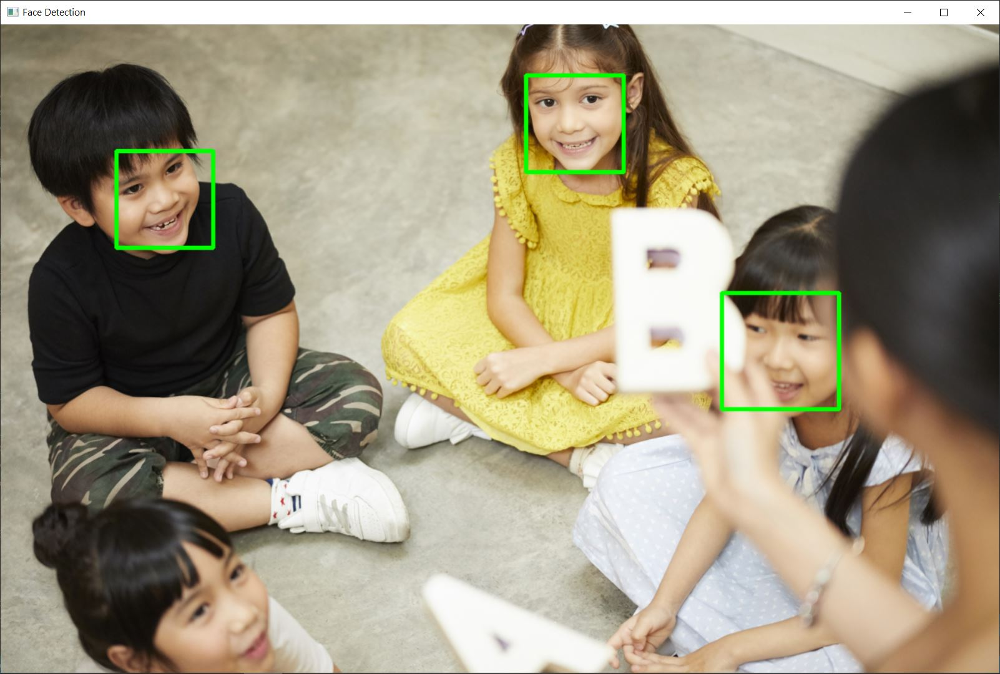
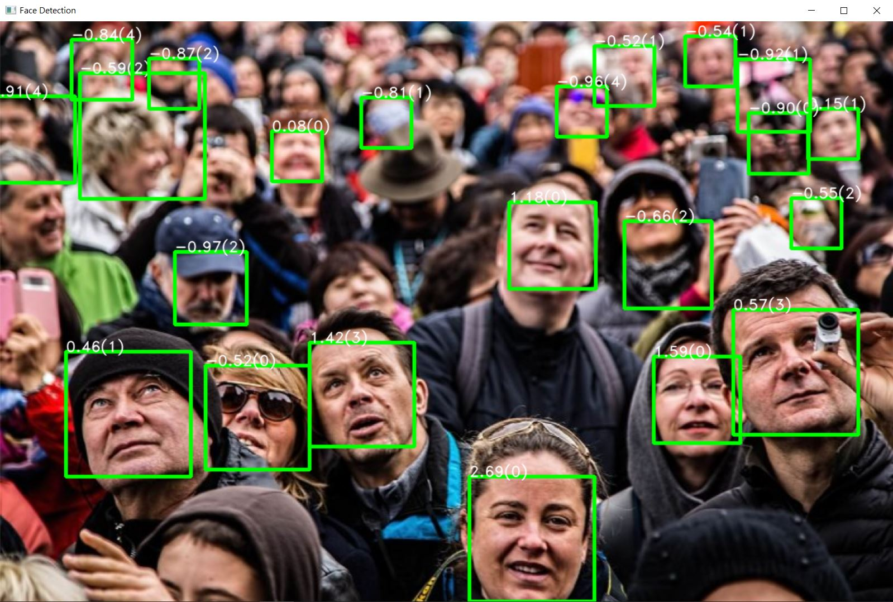
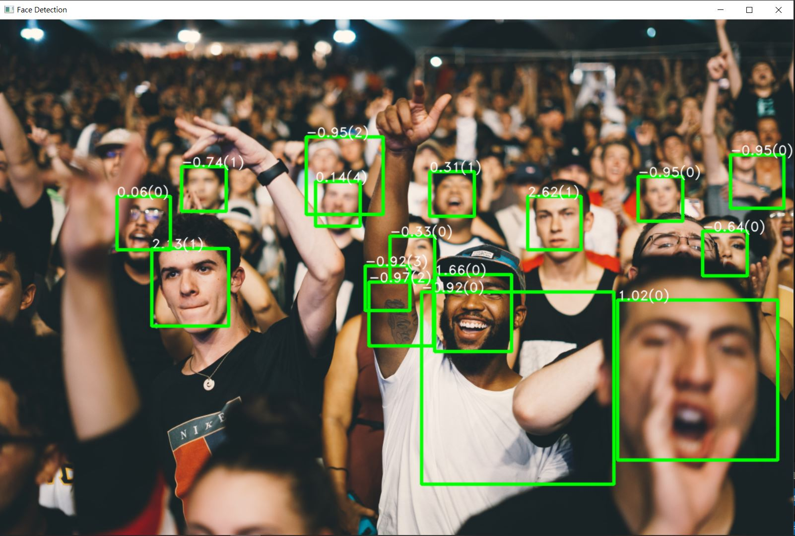
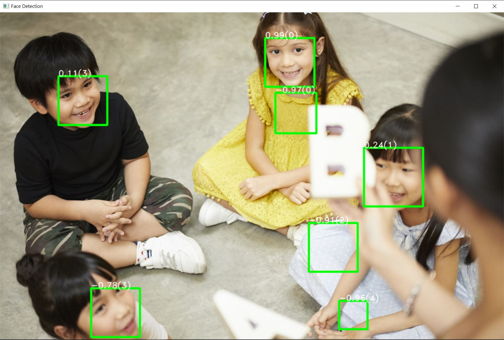
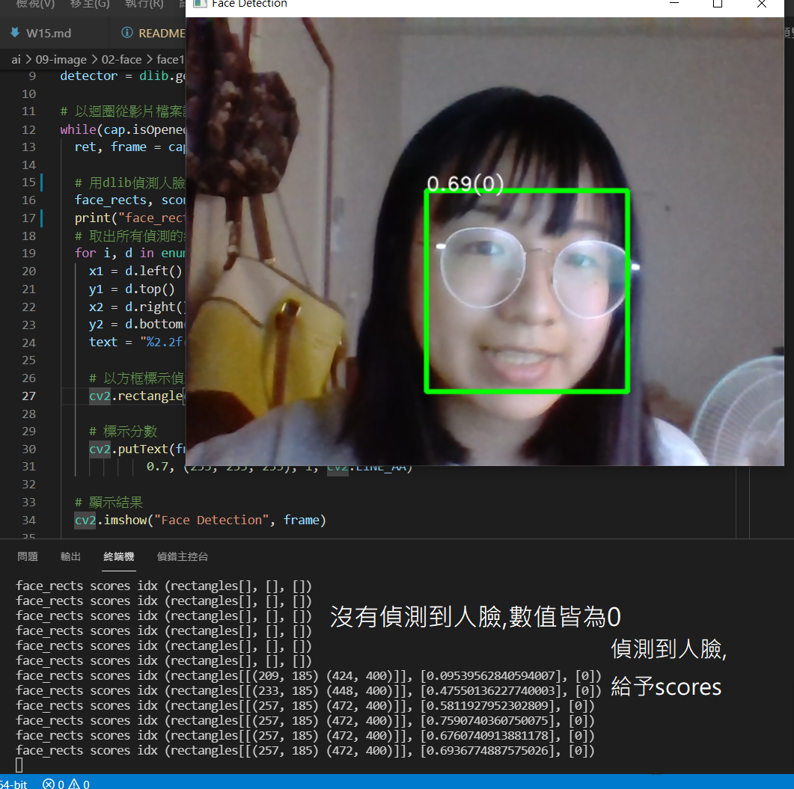

# 期末  -人臉辨識
1. 參考資料:  
    * [Python 使用 OpenCV、Dlib 實作即時人臉偵測程式教學](https://blog.gtwang.org/programming/python-opencv-dlib-face-detection-implementation-tutorial/)
    * [Python 與 OpenCV 基本讀取、顯示與儲存圖片教學](https://blog.gtwang.org/programming/opencv-basic-image-read-and-write-tutorial/)
    * [Python 與 OpenCV 加入線條圖案與文字教學](https://blog.gtwang.org/programming/opencv-drawing-functions-tutorial/)
    * [OpenCV WIKI](https://zh.wikipedia.org/wiki/OpenCV)
    * [dlib C++ Library](http://dlib.net/)
    * [【Python】 package之imutils介绍](https://blog.csdn.net/ztf312/article/details/88840855)

2. code使用:  
鍾誠老師上課資料:[programmermedia](http://programmermedia.org/root/%E9%99%B3%E9%8D%BE%E8%AA%A0/%E8%AA%B2%E7%A8%8B/%E4%BA%BA%E5%B7%A5%E6%99%BA%E6%85%A7/09-image/02-face/face1/)(ai\09-image\02-face)
並附上個人註解及測試內容

3. 套件使用
    1. OpenCV__讀取、顯示及儲存圖片
    2. Dlib_______圖像處理  
    3. imutils____使OpenCV結果可視化且可以進行旋轉縮放功能
## 套件介紹
### 1.關於 OpenCV(Open Source Computer Vision Library)
* 一個跨平台的計算機視覺庫。可以在商業和研究領域中免費使用。用於開發實時的圖像處理、計算機視覺以及模式識別程序。
* 應用領域:增強現實、*人臉識別*、手勢識別、人機交互、動作識別、運動跟蹤、物體識別、圖像分割、機器人

### 2.關於Dlib
* Dlib 是一個現代 C++ 工具包，包含機器學習算法和工具。它在工業界和學術界廣泛使用，包括機器人、嵌入式設備、移動電話和大型高性能計算環境。Dlib 的開源許可，允許您在任何應用程序中免費使用它。
* 提供大量機器學習算法、圖像處理功能

## 圖片辨識人臉 

>測試圖片
>>

1. faceRecognition.py
    * [code](ai109b\期末作業\face1\faceRecognition.py)
```python
import dlib
import cv2
import imutils

img = cv2.imread('image.jpg')               # cv2.imread讀取照片圖檔
img = imutils.resize(img, width=1280)       # imutils縮小圖片
detector = dlib.get_frontal_face_detector() # Dlib 的人臉偵測器

# 偵測人臉
face_rects = detector(img, 0)   #無設定score所以只會出現0以上之人臉判定
## print("face_rects=",face_rects)

# 取出所有偵測的結果
for i, d in enumerate(face_rects):
  x1 = d.left()
  y1 = d.top()
  x2 = d.right()
  y2 = d.bottom()


  # 以方框標示偵測的人臉(圖片,左上角,右下角)
  cv2.rectangle(img, (x1, y1), (x2, y2), (0, 255, 0), 4, cv2.LINE_AA)


cv2.imshow("Face Detection", img)   # 顯示結果
cv2.waitKey(0)                      #等待與讀取使用者按下的按鍵,0代表持續等待至使用者按下按鍵
cv2.destroyAllWindows()             #關閉 OpenCV視窗
```
>結果 被遮住或是過模糊的臉部無法辨識,亞洲臉孔及小孩皆能辨識




2. faceScore.py

```python
import dlib
import cv2
import imutils

img = cv2.imread('image.jpg')                   #讀取圖片
img = imutils.resize(img, width=1280)           #imutils縮放圖片
detector = dlib.get_frontal_face_detector()     #dlib獲取人臉資料進行偵測

# 偵測人臉，輸出分數
face_rects, scores, idx = detector.run(img, 0, -1) # 超過 -1 分的人臉都算 ,無標示則會默認為0 

for i, d in enumerate(face_rects):    #取出所有偵測的結果
  x1 = d.left()
  y1 = d.top()
  x2 = d.right()
  y2 = d.bottom()
  text = "%2.2f(%d)" % (scores[i], idx[i])
  cv2.rectangle(img, (x1, y1), (x2, y2), (0, 255, 0), 4, cv2.LINE_AA)   ##標出人臉
  # 標示分數
  # cv2.putText(影像, 文字, 座標, 字型, 大小, 顏色, 線條寬度, 線條種類)
  cv2.putText(img, text, (x1, y1), cv2.FONT_HERSHEY_DUPLEX,
          0.7, (255, 255, 255), 1, cv2.LINE_AA)

cv2.imshow("Face Detection", img)
cv2.waitKey(0)
cv2.destroyAllWindows()
```
>結果 因score設置為-1 門檻較寬鬆 增加了許多偏模糊的人臉辨識及線條多凌亂的非人臉




## 即時辨識人臉 faceCamera.py
* [code](ai109b\期末作業\face1\faceCamera.py)

```python
import dlib
import cv2
import imutils

# 開啟影片檔案
cap = cv2.VideoCapture(0)

# Dlib 的人臉偵測器
detector = dlib.get_frontal_face_detector()

# 以迴圈從影片檔案讀取影格，並顯示出來
while(cap.isOpened()):
  ret, frame = cap.read()

  # *1用dlib偵測人臉並賦予scores
  face_rects, scores, idx = detector.run(frame, 0,-1)
  ## print("face_rects", "scores", "idx",detector.run(frame, 0))

  # 取出所有偵測的結果
  for i, d in enumerate(face_rects):
    x1 = d.left()
    y1 = d.top()
    x2 = d.right()
    y2 = d.bottom()
    text = "%2.2f(%d)" % (scores[i], idx[i])

    # 以方框標示偵測的人臉
    cv2.rectangle(frame, (x1, y1), (x2, y2), (0, 255, 0), 4, cv2.LINE_AA)

    # 標示Scores
    cv2.putText(frame, text, (x1, y1), cv2.FONT_HERSHEY_DUPLEX,
            0.7, (255, 255, 255), 1, cv2.LINE_AA)

  # 顯示結果
  cv2.imshow("Face Detection", frame)

  if cv2.waitKey(1) & 0xFF == ord('q'):
    break

cap.release()
cv2.destroyAllWindows()
```
* *1 用dlib偵測人臉並賦予scores

